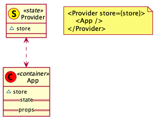

# 使用 UML Class 图表表示 React 组件间关系

## 组件定义

1. Provider

    定义: 全局状态注入与维护组件。

    

2. Container

    定义: 直接从全局状态树中获取状态，并提供给子组件的组件。与 Provider 直接交互，一般不可复用。

    

2. Component

    定义: 从父组件获取状态，不与 Provider 直接交互的组件。可复用。

    

## 组件组成关系

1. Provider --> Container

    

2. Container --> Component

    

3. Component --> Instance

    

完整关系示意图：

